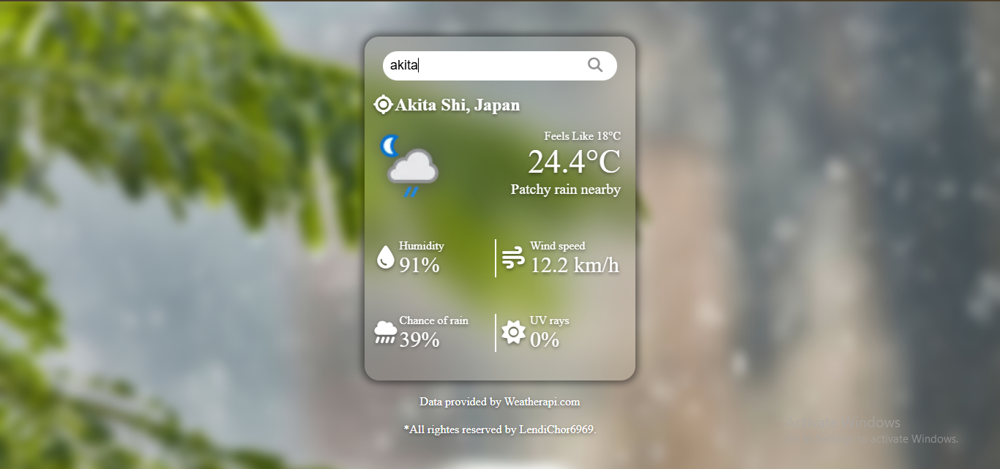

## Weather App
A weather application that displays real-time weather information using a Weather API.

## Live Demo
[Try the Weather App](https://gig-warrior.github.io/Weather-App/)

## Screenshorts

## Features
- Search any city
- Current Temperature, Humidity, Wind Speed, Chance of Rain, UV Rays
- Weather Icon
- Country & Location
- Dynamic Background According To The Weather

## Technologies
- HTML
- CSS
- JavaScript
- Weather API

## What I Learned
- Fetch API
- JSON
- Async/Await
- DOM Manipulation
- Error Handling

## Future Improvements
- 5-Day Forecast
- More Dynamically Enhanced UI
